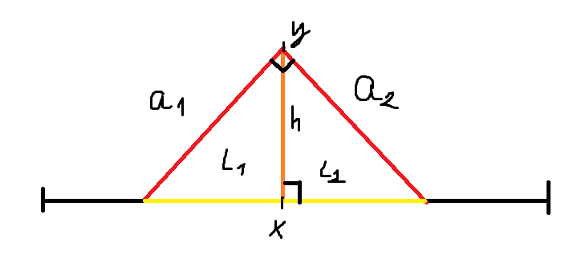
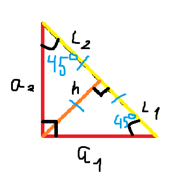

## Фонари

### Условие
На улице длиной **100** метров установлено $N$ фонарей высотой $y_1, y_2, ..., y_N$ метров на расстоянии $x_1, x_2, ..., x_N$ метров от начала улицы. Форма отражателей такова, что свет каждого фонаря распространяется распространяется в пределах конуса с **углом при вершине $90^o$**.

Требуется определить яркость самого освещённого участка улицы, т.е. **максимальное количество фонарей, освещающих один и тот же участок**.

### Идея
- Найти какой участок освещает каждый фонарь
- Посчитать для каждого метра сколько его освещает фонарей
- Найти максимальное число

### Решение
1. Найти участок освещения каждого фонаря



На рисунке показан **один** фонарь и его принцип работы. 

- Оранжевый - столб фонаря
- Красный - проекция конуса на 2D мир(треугольник, который показывает распространение света)
- Желтый - зона освещения
- $a_i$ - стороны треугольника
- $l_i$ - отрезки зоны освещения
- $h$ - высота столба

Если повернуть в более удобном виде данный **прямоугольный** треугольник, то увидим следующее:


Пользуемся простой геометрией, чтобы понять, как посчитать каждый участок освещения фонаря.

Поскольку у нас в основании фонаря(угол при вершине) угол $90^o$, то остальные углы большого треугольника будут по $45^o$. Фонарь у нас стоит перпендикулярно же(логика), то его столб в **точке х** будет высотой треугольника из угла при вершине, которая падает на сторону(зону освещения) под углом $90^o$. 

Ничего не мешает рассматривать уже 2 треугольника. Поскольку углы большого треугольника(по краям) $45^o$ и высота образует угол $90^o$, то большой угол делится по полам, образуя угол $90^o / 2 = 45^o$. Получется равнобедренный треугольник, у которого зона освещения($l_1$ например) равна высоте фонаря.
Аналогично для $l_2$.

**Будем считать зону как начало и конец(2 числа).
$l_1$ обозначим за начало зоны освещения, а $l_2$ за конец.**

Считается $l_1$ как $x - h$, где $х$ - местонахождение фонаря, $h$ - высота фонаря(в задаче она обозначена за $y$)

Считается $l_2$ как $x + h$, где $х$ - местонахождение фонаря, $h$ - высота фонаря(в задаче она обозначена за $y$)

2. Посчитать для каждого метра сколько его освещает фонарей

Поскольку у нас улица 100 метров, то можно ее имитировать - создать вектор из 100 элементов, где все элементы равны 0.

Как посчитать участки освещения понятно из прошлого пункта, но как их хранить?

Создаем вектор для участков размером $<кол-во ламп>~*~2$. Делаем это, чтобы хранить начало и конец участка для каждого фонаря.

Сохранили, ок, а как считать то улицу?

Проходимся циклом от 0 до 100(не включительно) - это будет наш метр улицы(пусть будет $i$). Заводим счетчик, который будет считать кол-во фонарей, которые освещают данный метр. 

Делаем вложенный цикл, для прохода по участкам освещения(пусть будет $j$). Начинаем с 1, шаг делаем 2(чтобы смотреть на конец и начало участка одного фонаря и перескакивать на те же данные для другого фонаря). Считываем начало(```<массив участков>[j-1]```) учатска и конец(```<массив участков>[j]```).

Теперь нужно условие, чтобы считать кол-во фонарей на данном метре. Оно выглядит следующим образом:
```c++
if (i >= start && i < stop) {
  count++;
}
```

Я не помню почему не ```i <= stop```, но есть предположение, что в задаче стык фонарей в одной точке считается, что эту точку освещает 1 фонарь. Либо я на опыте покрутил это неравенство, пока не прошло)).

Теперь после вложенного цикла присваиваем нашему метру посчитанный счетчик и все, получаем вектор улицы, с посчитанным кол-вом фонарей.

3. Найти максимальное число

Ответом будет максимальное число из вектора посчитанной улицы. Как его искать уже ваше дело)